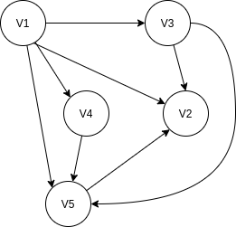
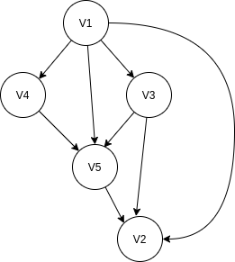

# Reconciling object state using DAG

In distributed, asynchronous systems, state management has its challenges,
because as you might know: "Everything Fails All the Time" (Werner Vogels).
To ensure a consistent async state update in a distributed system, a component must
reconcile the desired state, i.e. check if the outcome of their previous state-manipulating
request to another component corresponds to the desired state.  If this is not the
case, the component repeats the update requests and checks again. 

Kubernetes represents an asynchronous, distributed state manager. You declare the
desired state for a component instance, and kubernetes tries to create and maintain
that state should anything change.

"Reconcile" is the basic pattern in kubernetes where controllers ensure that,
for any given object, the actual state of the world (both the cluster state,
and potentially external state e.g. loadbalancers for a cloud provider)
matches the desired state declared in the object.

If the desired state is "simple", like create one loadbalancer with this config (spec),
one can easily imagine, how to reconcile that: we try to create the loadbalancer
with a call to an external API and if this fails, we queue this task to try again later.

But what if you have to reconcile desired state with an external API that
consists of a bunch of objects that have to be created in a specific order,
i.e. that have dependencies among each other?

In our case we had to deal with a legacy Identity and Access Management System
which API must be handled with care. Our flow would first create two groups,
nest them, then create a new role and finally assign the groups to the new role.
There are fine grained SOAP-Services for all of the tasks, but each of
the services can be temporarily unavailable or fail individually.
For deletion, the whole process must be executed in reverse.

Of course, we could create the objects arbitrarily with a "brute force" approach
and retry creation until all errors have vanished. This simple approach is not always
appropriate, and in certain cases unacceptable. If you have to call APIs
of shaky legacy subsystems for example, this careless strategy might cause severe
problems, even if it is only the legacy system's ops guy that comes along
asking why his logs are full of business errors and what the heck you are doing.
So sometimes, we need to go a more focused route.

## DAGs to the rescue

To model the dependencies between the required tasks we need a data structure
and an algorithm to calculate the right order in which to execute the tasks.

This is when DAGs come into play. A directed acyclic graph (DAG) is a directed graph
with no directed cycles, which allows us to model tasks (as vertices) and dependencies
(as directed edges) in a "natural way".

The following simple example DAG models the following dependencies ("V" = vertex):
* V1 depends on V2, V3, V4 and V5
* V2 has no dependencies
* V3 depends on V2 and V5
* V4 depends on V5
* V5 depends on V2



Every DAG has at least one "topological ordering", i.e. a sequence of the vertices such that
every edge is directed from earlier to later in the sequence.



Valid topological ordering of our DAG are: "V1 V3 V4 V5 V2" or "V1 V4 V3 V5 V2". The sequence
shows that task "V1" heavily depends on other tasks, where "V2" has no dependencies.

The correct sequences of tasks to resolve the dependencies is the reverse topological
ordering: "V2 V5 V3 V4 V1" or "V2 V5 V4 V3 V1". We start with task "V2" that has
no outgoing dependencies we can execute the tasks in the sequence of the topological sort
in "ascending direction", i.e. reversing the sort order.

In our code we can solve this reversing of tasks by the following strategies:
1. we calculate the topological order of our dependency tree and reverse the order
1. we reverse the edge direction when adding an edge to the graph so that the edge-direction
   models a "must come before" relation instead of "depends on"

To get rid of ambiguous equivalent topological task-sequences (e.g. for unit-tests) we can
stabilize the ordering by adding a second sort-criteria like lexical ordering by vertex id.

DAGs are featured in many projects that share have to solve our problem of executing
a series of tasks in the right order: [Terraform](https://github.com/hashicorp/terraform/tree/main/internal/dag), [Gitlab CI](https://docs.gitlab.com/ee/ci/directed_acyclic_graph/), [Gardener](https://github.com/gardener/gardener/tree/master/pkg/utils/flow).
These systems use internal packages, so we have to bring up something lightweight on our own.

## DAGs with Go

Now that we know what we need as data-structure and algorithm, we need to figure out how to
implement this in Go.
We can use the [gonum-library](https://github.com/gonum/gonum) that has a vast set of numeric
algorithms and also features a [graph package](https://pkg.go.dev/gonum.org/v1/gonum/graph).
This library has much more than we need, of course, but for the sake of only showing the
application of DAGs to the problem we want to solve (and not implementing DAG ourselves),
let's go with it for now.

The code that models our example graph in go is straightforward. We simply create a directed graph
and some nodes and add them with directed edges to the graph.
After that we are able to calculate a stabilized topological sort (second param 'nil' defaults
to lexical sort):

```
// ex1_graph
package main

import (
	"fmt"
	"gonum.org/v1/gonum/graph/simple"
	"gonum.org/v1/gonum/graph/topo"
)

func main() {
	g := simple.NewDirectedGraph()
	n1 := simple.Node(1)
	n2 := simple.Node(2)
	n3 := simple.Node(3)
	n4 := simple.Node(4)
	n5 := simple.Node(5)
	g.SetEdge(g.NewEdge(n1, n2))
	g.SetEdge(g.NewEdge(n1, n3))
	g.SetEdge(g.NewEdge(n1, n4))
	g.SetEdge(g.NewEdge(n1, n5))
	g.SetEdge(g.NewEdge(n3, n2))
	g.SetEdge(g.NewEdge(n3, n5))
	g.SetEdge(g.NewEdge(n4, n5))
	g.SetEdge(g.NewEdge(n5, n2))

	nodes, _ := topo.SortStabilized(g, nil)

	// reverse result
	for i, j := 0, len(nodes)-1; i < j; i, j = i+1, j-1 {
		nodes[i], nodes[j] = nodes[j], nodes[i]
	}
	fmt.Printf("%v\n", nodes)
}
```

Now we are all set to use the DAG to model the dependencies as graph and determine
the required execution order of tasks taking the dependencies into account.

## Reconcile object state

The following fragments of the flow-package (/pkg/flow) illustrate, how we can build
a reconciliation workflow on top of a DAG.

The nodes of the graph resemble the tasks that have to be executed, the edges are dependencies
between those tasks. In order to be able to reconcile the desired state that is modeled by our graph,
we need to create a companion data structure and a contract for the reconcile-tasks.

```
// Fn is where the task's logic must be placed.
// If the task is successful, it must return nil.
// If the task returns a FatalError, it indicates that it cannot be retried.
// The task can indicate by returning any other error, that it can be retried.
type Fn func(ctx context.Context, task *Task) error

type Task struct {
	id   int64
	desc string
	reconcileFn   Fn
}
```

The Workflow consists of a DAG that models the dependencies and associated Tasks for each node of the graph.

```
type Workflow struct {
	// DAG
	graph *simple.DirectedGraph
	// associated Tasks, key is nodeID
	tasks map[int64]*Task
}
```

We need some methods to add Tasks to the Workflow and define Dependencies between Tasks. Errors can occur
when the dependencies violate the DAG-property of the graph, i.e. if cyclic dependencies are added.
If we add a dependency from V5 to V1 to our example graph, a call to topo.SortStabilized will result in
"topo: no topological ordering: cyclic components: [[1 3 4 5]]", where "[1 3 4 5]" shows the members
of the cyclic component.

Each reconcile traverses the stabilized topological task-sequence and calls the Tasks, so that each task
can reconcile it's state with the legacy-system and make adjustments if necessary.

```
// Reconcile executes the workflow tasks in order and returns nil, if all tasks completed successfully.
// If a FatalError is returned, the workflow failed and cannot be retried.
func (w *Workflow) Reconcile(ctx context.Context) error {
	tasks, err := w.GetOrderedTasks()
	if err != nil {
		return FatalError{ err: err	}
	}

	for _, task := range tasks {
		if cancelErr := ctx.Err(); cancelErr == nil {
			err := task.reconcileFn(ctx, task)
			// the workflow runs unless some task returns an error
			if err != nil {
				return err
			}
		}
	}
	return nil
}
```

It is the duty of the caller of reconcile to determine if the workflow ended successfully or with
a fatal or retryable error and act accordingly.

In the example, the reconcile-loop repeats the reconciliation after 5 seconds as long as the workflow
does not complete successfully or ends with fatal error.

```
	ctx := context.Background()
	err := w.Reconcile(ctx)
	for ; err != nil; {
		var fatalErr flow.FatalError
		if errors.As(err, &fatalErr) {
			log.Fatalf(fatalErr.Error())
		} else {
			log.Println(err)
		}
		// retry after some time
		time.Sleep(5 * time.Second)
		err = w.Reconcile(ctx)
	}
```

In the flow-example, each task will fail a configurable number of times before it signals success.
We can watch, how the workflow reconciles each task in the right order, in multiple reconciliation
runs until the desired state is reached.

```
2021/05/21 18:51:48 task 2 (create V2) >> task 5 (create V5) >> task 3 (create V3) >> task 4 (create V4) >> task 1 (create V1)
2021/05/21 18:51:48 --- reconcile run 1 ---
2021/05/21 18:51:48 reconcile task 2 (create V2) success          <-- task 2 completed successfully
2021/05/21 18:51:48 reconce task 5 (create V5) error, 1 remain    <-- task 5 failed in this run, workflow is not complete
2021/05/21 18:51:50 --- reconcile run 2 ---                       <-- after two seconds, the next run starts
2021/05/21 18:51:50 reconcile task 2 (create V2) ok               <-- task 2 is still ok
2021/05/21 18:51:50 reconcile task 5 (create V5) success          <-- task 5 completed successfully
2021/05/21 18:51:50 reconcile task 3 (create V3) success          <-- task 3 completed successfully
2021/05/21 18:51:50 reconce task 4 (create V4) error, 1 remain    <-- task 4 failed in this run, workflow is not complete
2021/05/21 18:51:52 --- reconcile run 3 ---
2021/05/21 18:51:52 reconcile task 2 (create V2) ok
2021/05/21 18:51:52 reconcile task 5 (create V5) ok
2021/05/21 18:51:52 reconcile task 3 (create V3) ok
2021/05/21 18:51:52 reconcile task 4 (create V4) success          <-- task 4 completed successfully this time
2021/05/21 18:51:52 reconce task 1 (create V1) error, 2 remain    <-- task 1 failed, workflow not complete
2021/05/21 18:51:54 --- reconcile run 4 ---
2021/05/21 18:51:54 reconcile task 2 (create V2) ok
2021/05/21 18:51:54 reconcile task 5 (create V5) ok
2021/05/21 18:51:54 reconcile task 3 (create V3) ok
2021/05/21 18:51:54 reconcile task 4 (create V4) ok
2021/05/21 18:51:54 reconce task 1 (create V1) error, 1 remain    <-- task 1 failed again, workflow not complete
2021/05/21 18:51:56 --- reconcile run 5 ---
2021/05/21 18:51:56 reconcile task 2 (create V2) ok
2021/05/21 18:51:56 reconcile task 5 (create V5) ok
2021/05/21 18:51:56 reconcile task 3 (create V3) ok
2021/05/21 18:51:56 reconcile task 4 (create V4) ok
2021/05/21 18:51:56 reconcile task 1 (create V1) success          <-- task 1 completed successfully, the workflow is complete
```

## Final thoughts

We have explored how DAGs can help us to model dependencies between tasks and determine a correct
execution order for the tasks. Using the gonum-library, we can create and use DAGs in Go.
With some additional code we have built a tiny workflow package that allows us to execute
interdependent tasks in the right order.

In conjunction with the task contract and a reconciliation loop we can now reconcile complex
state in a caring and focused manner and be polite to our legacy-systems.
